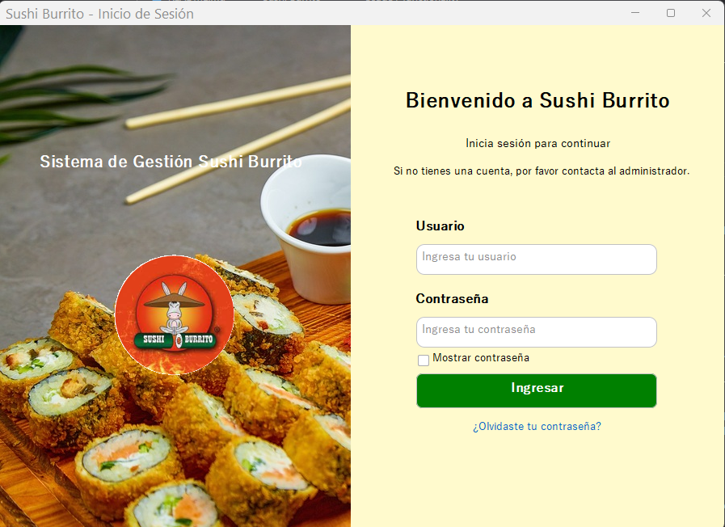
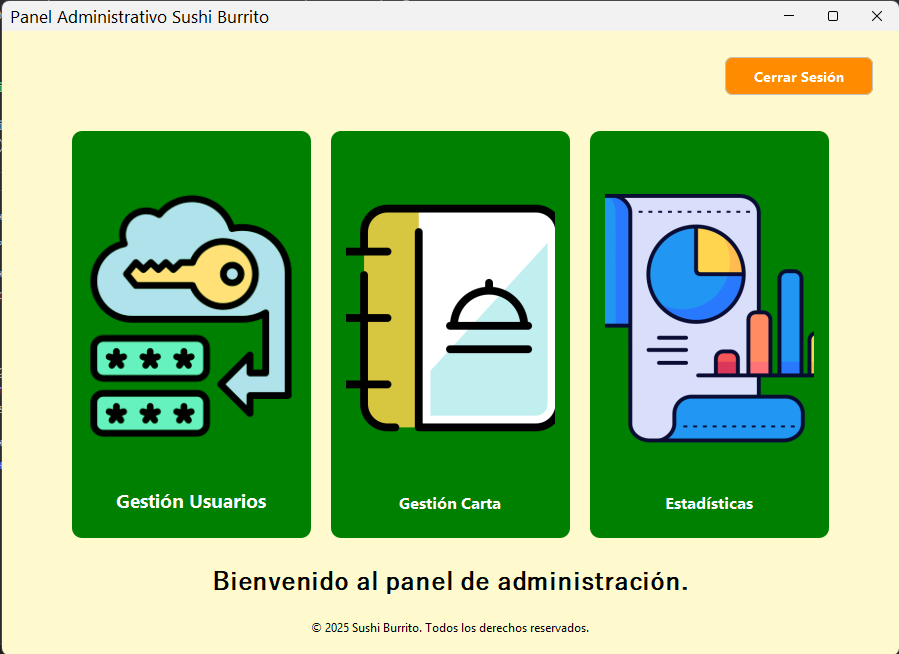
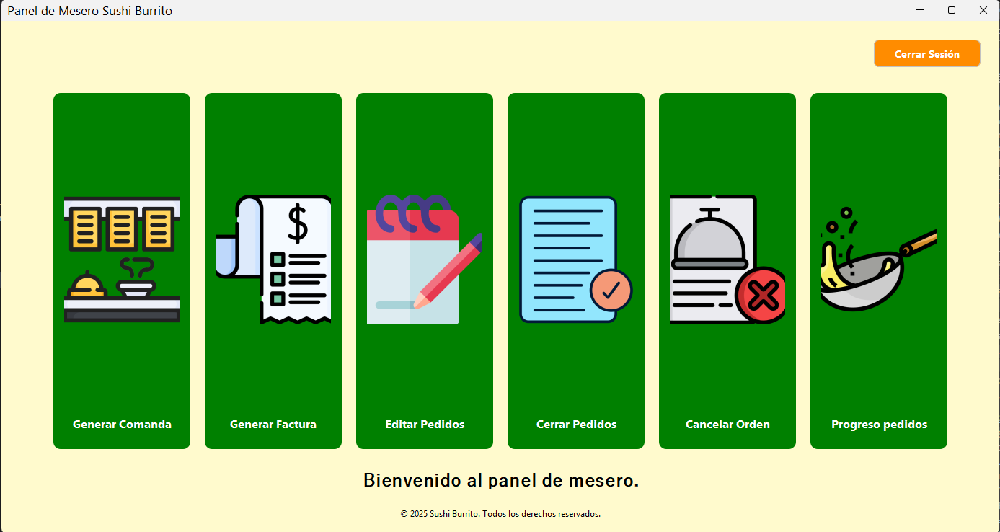
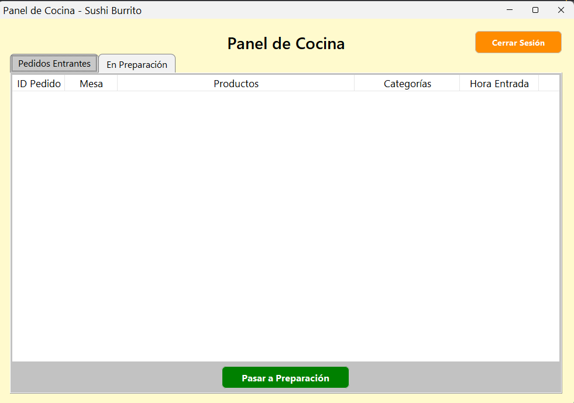
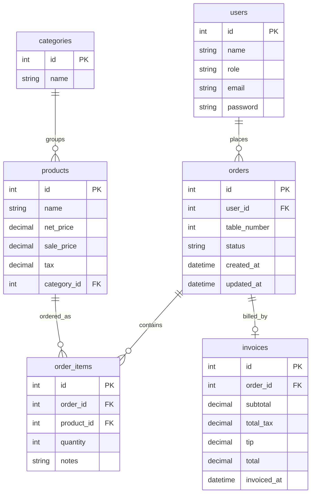

# Sushi Burrito

Desktop application for managing a small restaurant: taking orders, running the kitchen queue, and
billing customers. It is a Java **Swing** desktop app hosted inside a **Spring Boot** container
(dependency injection, Spring Data JPA, connection pooling) with a **MySQL** database and versioned
**Flyway** migrations. It ships as a **self-contained native installer** — the end user does not need
Java installed.

> The application was refactored iteration by iteration from a native Eclipse/Swing project into this
> Spring Boot architecture. The visible Swing UI is intentionally preserved; UI text stays in Spanish
> while all code, schema, and documentation are in English.

---

## Purpose

Give a restaurant's staff a single tool covering the day-to-day flow, split by role:

- **Administrator (administrador)** — manage users and the menu (products/categories), and review sales statistics.
- **Waiter (mesero)** — create, edit, cancel and close orders, and generate invoices (PDF).
- **Cook (cocinero)** — watch the live kitchen queue and advance order status.

The core business flow is **order (Waiter) → kitchen (Cook) → invoice (Waiter)**, with sales statistics on top(Administrator).

---

## Requirements

**To run the installed application**

- Windows 10/11 (the `.msi` installer) or macOS (the `.dmg`, see [packaging](packaging/README.md)).
- A reachable **MySQL** database (local or [Railway](https://railway.app)). Java is **not** required —
  the installer embeds its own trimmed Java runtime.

**To build from source**

- **JDK 21+** (the project targets Java 21; JDK 23/25 also work).
- **Maven 3.9+**.
- A MySQL database to run against (tests do not need one — they use in-memory H2).

---

## Installation

### Option A — native installer (end users)

1. Build or obtain the installer for your OS (see [`packaging/README.md`](packaging/README.md)):
   - Windows: `dist/Sushi Burrito-1.0.0.msi`
   - macOS: `dist/Sushi Burrito-1.0.0.dmg`
2. Run the installer (double-click). On Windows it installs to *Program Files* and adds a Start-menu
   shortcut.
3. **Configure the database before the first launch** by setting these environment variables — on
   Windows as *user* environment variables so the shortcut inherits them:

   | Variable | Example | Notes |
   |---|---|---|
   | `DB_URL` | `jdbc:mysql://<host>:<port>/sushiburrito_db` | JDBC form, no credentials embedded |
   | `DB_USERNAME` | `root` | required, no fallback |
   | `DB_PASSWORD` | *(secret)* | required, no fallback |
   | `SPRING_PROFILES_ACTIVE` | `railway` | only when targeting Railway |

   On first startup Flyway creates the schema and seeds the demo data automatically. If the variables
   are missing the app fails to connect on startup, by design.

### Option B — run from source (developers)

```bash
# 1. Package the executable fat jar (JDK 21+ required)
mvn clean package

# 2. Provide database credentials (either export them or use application-local.properties — see below)
export DB_URL="jdbc:mysql://localhost:3306/sushiburrito_db"
export DB_USERNAME="root"
export DB_PASSWORD="your-password"

# 3. Run
java -jar target/sushi-burrito.jar
```

To target Railway instead of a local MySQL, also set `SPRING_PROFILES_ACTIVE=railway`.

---

## Configuration

Credentials are **never** stored in the repository. They come from environment variables or from a
gitignored local file:

- **Environment variables** — `DB_URL`, `DB_USERNAME`, `DB_PASSWORD` (and `SPRING_PROFILES_ACTIVE` for
  Railway).
- **Local file** — copy [`application-local.properties.example`](application-local.properties.example)
  to `application-local.properties` (gitignored) next to the jar/project root and fill in the values.
  It is imported automatically when present.

Profiles:

- *default* — common settings; `DB_URL` defaults to `localhost` (a host name is not a secret) while
  username/password have no fallback.
- *railway* — [`application-railway.properties`](src/main/resources/application-railway.properties);
  no localhost fallback, so a missing variable fails fast.

Passwords are hashed with **BCrypt** (via a `DelegatingPasswordEncoder`); legacy SHA-256 accounts are
transparently re-hashed on their next successful login.

---

## Demo credentials

The Flyway seed (`V2`) creates one account per role. Passwords below are the plaintext used in the
demo:

| Role | Email | Password |
|---|---|---|
| Administrator | `admin@sushiburrito.com` | `admin123` |
| Waiter | `waiter@sushiburrito.com` | `waiter123` |
| Cook | `cook@sushiburrito.com` | `cook123` |

The seed also loads a menu (sushi, burritos, drinks, desserts), one in-progress order for the kitchen
queue, and one already-paid order with its invoice so the statistics screen has data.

---

## Usage / functionality

Log in from the **Login** window; the destination panel depends on the account's role.


### Administrator



- **Users management** — register, edit email, and delete users; passwords must meet the strength
  policy (min 8 chars, upper/lower/digit/special).
- **Menu management** — create, edit and delete products and their categories.
- **Sales statistics** — pick a date range to see billed invoices, total revenue, and the
  best/worst-selling products.

### Waiter (mesero)



- **Create order** (*generar comanda*) — pick a table and add products with quantities/notes; the
  order enters as `pendiente` and appears in the kitchen queue.
- **Orders in progress**, **edit order**, **cancel order**, **close orders** — manage the order
  lifecycle.
- **Generate invoice** (*generar factura*) — for a delivered/in-preparation order, computes
  `subtotal + 8% tax + tip` (suggested 10%), persists the invoice as an accounting snapshot, marks the
  order `pagado`, and produces a PDF.

### Cook (cocinero)



- **Kitchen panel** — sees pending and in-preparation orders (product/category summaries rebuilt from
  the line items) and advances their status.

### Main flow

```
Waiter creates order  →  Cook prepares it (kitchen queue)  →  Waiter invoices it (PDF)  →  Admin sees it in statistics
```

---


## Architecture

Layered design hosted in a Spring context:

```
Swing Views  →  Services (@Service)  →  Spring Data Repositories  →  JPA Entities  →  MySQL
```

- **Views** (`views/**`) — Swing only; they resolve service beans via `SpringContext` and orchestrate
  UI. No SQL, no business rules.
- **Services** (`service/**`) — business rules and transactions (`@Transactional`); free of any Swing
  dependency, returning values or throwing domain exceptions (`exception/**`).
- **Repositories** (`repository/**`) — Spring Data JPA interfaces, one per aggregate.
- **Entities** (`models/**`) — JPA entities mapping 1:1 to the English snake_case schema.
- **Cross-cutting** — `security/**` (BCrypt encoder), `validation/**` (credential rules),
  `navigation/**` (view navigation), `config/**` (Spring context accessor).

### Data model (3NF)



The denormalised product/category text once stored on orders is replaced by the read-only
`v_order_summary` view, keeping `order_items` the single source of truth. Invoice amounts are a
deliberate accounting snapshot frozen at billing time.

### Technology

| Concern | Technology |
|---|---|
| Container / DI | Spring Boot 3.3 (`spring-boot-starter`, no web) |
| Persistence | Spring Data JPA (Hibernate) + HikariCP |
| Database | MySQL (local or Railway) |
| Migrations | Flyway |
| Password hashing | `spring-security-crypto` (BCrypt) |
| UI | Swing + FlatLaf + JCalendar |
| Invoice PDF | Apache PDFBox |
| Packaging | `jpackage` + `jlink` (embedded runtime) |
| Tests | JUnit 5, AssertJ, Mockito, H2 |

---

## Building and testing

```bash
# Compile, run tests, and produce target/sushi-burrito.jar
mvn clean package

# Tests only (no database needed — they run against in-memory H2)
mvn test
```

> The default `JAVA_HOME` on the build machine may point to JDK 17, which fails with *"release version
> 21 not supported"*. Point `JAVA_HOME` at a JDK 21+ before building, e.g. on Windows (Git Bash):
> `export JAVA_HOME="/c/Program Files/Java/jdk-23"`.

The test suite is intentionally small and demo-focused: a `@SpringBootTest` context-load smoke test
(the whole wiring starts), a `UserService` registration→authentication integration test against H2,
and a mocked-repository unit test of `OrderService`.

To build the native installers, see [`packaging/README.md`](packaging/README.md).

---

## Project layout

```
src/main/java/com/restaurante/app/
├── SushiBurritoApplication.java   # entry point (Spring context boots, then Swing)
├── config/                        # SpringContext accessor
├── exception/                     # domain exceptions
├── models/                        # JPA entities + DTOs
├── navigation/                    # view navigation
├── repository/                    # Spring Data JPA repositories
├── security/                      # BCrypt password encoder
├── service/                       # business rules (@Service)
├── validation/                    # credential validation rules
└── views/                         # Swing UI (admin / authentication / cocina / mesero)
src/main/resources/
├── application*.properties        # config + profiles
├── db/migration/                  # Flyway migrations (V1 schema, V2/V4 demo seed, V3 BCrypt)
└── images/                        # UI assets
packaging/                         # native installer scripts and assets
```
